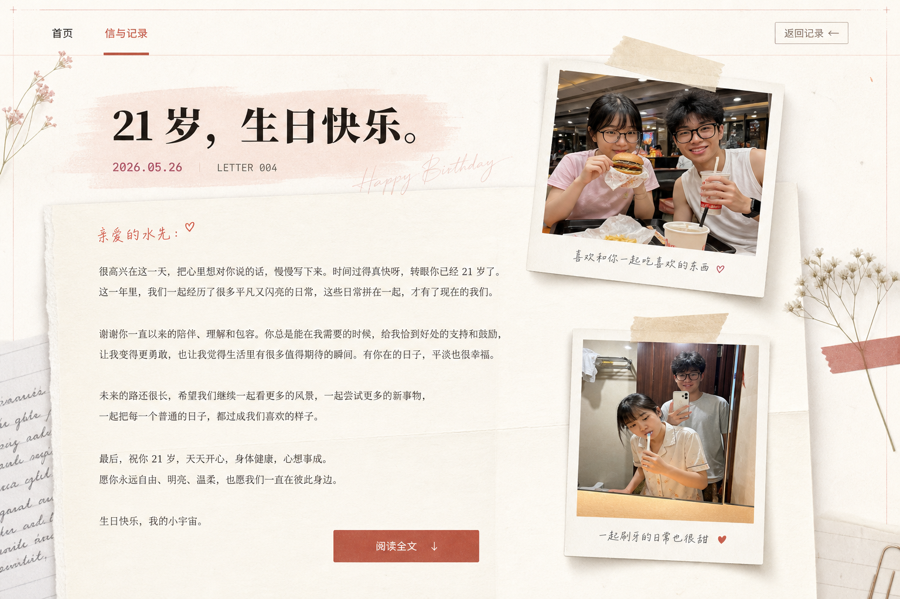

# Birthday 2026 Letter Detail Design

Date: 2026-05-30
Status: Design approved for spec review

## Goal

Add a dedicated detail page for the 2026 birthday letter at `/birthday-2026.html`.

The page should behave like a readable personal blog entry, but visually feel like a scrapbook letter page. `records.html` remains the collection/archive page and should only preview the letter. The full 2026 birthday letter lives on the detail page.

## Approved Direction

Use the "records preview plus independent detail page" approach:

- `/records.html` shows the 2026 birthday letter as a preview card only.
- The preview card links to `/birthday-2026.html`.
- The 2026 archive card also links to `/birthday-2026.html`.
- The homepage does not add a new entry point for this letter.
- `/birthday-2026.html` contains the full letter, two real photos, and a scrapbook-style reading layout.

This keeps the records page scannable while giving the 2026 letter enough space to feel intentional.

## Visual Reference

Approved reference image:



Generated with the built-in `image_gen` tool as a visual reference asset. It is not a final webpage screenshot. Implementation should translate the mood, layout, paper layers, photo cards, and reading hierarchy into real HTML/CSS.

### Reference Prompt

```text
Use case: ui-mockup
Asset type: website visual reference for a birthday letter detail page
Primary request: Generate a polished desktop web page mockup for a Chinese romantic birthday letter detail page, scrapbook / personal diary style, intended for /birthday-2026.html. This is a visual design reference, not final implementation.
Scene/backdrop: warm off-white paper canvas with subtle paper fibers, faint grid lines, soft tape marks, small handwritten annotation details, quiet romantic archive mood.
Subject: a long-form birthday letter page for a couple, with a top cover area, date label, title, readable letter sheet, two casual daily-life photo placeholders styled as polaroids.
Style/medium: high-fidelity website UI mockup, editorial scrapbook, hand-made paper collage, tasteful and mature, not childish.
Composition/framing: 16:9 desktop screenshot. Top has compact navigation and a back-to-records link. Main page has a hero title block on the left: "21 岁，生日快乐。" with date "2026.05.26" and small label "LETTER 004". Below/right is a long cream letter sheet with multiple paragraph blocks. Add two polaroid photo cards: one near the opening section showing a casual fast-food date placeholder, one near the lower section showing a cozy bathroom mirror daily-life placeholder. Photos should look like intentionally placed real snapshots but not use identifiable real people.
Lighting/mood: soft morning light, warm highlights, gentle shadows from paper layers and photo cards.
Color palette: cream, warm white, muted coral, ink black, soft gray, tiny red accent marks; avoid dark blue/purple gradient themes.
Materials/textures: paper grain, translucent tape, photo paper border, thin red registration/grid marks, subtle folded paper edges.
Text (verbatim, large headings only): "21 岁，生日快乐。", "2026.05.26", "LETTER 004", "阅读全文", "返回记录".
Constraints: No marketing landing page. The page must feel like a readable letter/blog detail page, not a poster only. Leave generous reading space. Keep UI elements realistic for implementation in HTML/CSS. Use placeholder body text blocks instead of attempting to render the full letter. Do not include extra timelines, charts, or numeric widgets. No watermark. No logo.
```

## Confirmed Content Decisions

- Detail page title: `21 岁，生日快乐。`
- Detail page URL: `/birthday-2026.html`
- Letter date: `2026.05.26`
- Letter label: `LETTER 004`
- Full letter wording: preserve the user's original wording. Do not rewrite, polish, shorten, or paraphrase it.
- Records page summary: write a short preview summary instead of showing the first full paragraphs.
- Extra timeline: do not add a separate `第 4 个生日 / 18→21 / 1095 天` timeline. Those ideas stay naturally inside the body text.
- Photos: use the two user-provided photos as real page imagery.

## Source Letter

The implementation must preserve this wording. Only paragraph grouping and layout wrapping are allowed.

```text
已经是第4个生日了哦，三年那就是1095天，很多个日子了。
每一年都很不一样，每过的一年都比上一年进展了很多，可以说是最最能确定你是对的人的时刻，可以说是目前为止我们的路径最最明晰的日子，但要问我希望每一年都这样吗？我拿不准，我们一直在沉淀发展打怪升级，今年做到了恐怖的进展 我找了实习，我之前所有的积累都得到了兑现，你也即将要来一起实习，我们一起同居做好多好多事情，我预料有一天这样的增速会停滞，当然意料之中，我们有一天也会慢下来，我们的事业还是爱情都有可能会，但是慢不是停，我们可能真的老两口就在新西兰养羊呢，过那种你喜欢的慢慢的生活，那时候我们应该也默契到像AI一样精准猜出对方的下一个字吧。
但有你真再开心不过，我们一起见证了无数我们的成长，想起来 现在一起躺着 想每天同居 真的是非常期待的日子，没有了之前那么多羞涩，触手可及，实实在在的知道是什么感觉，在一起的幸福就是这样吧。
我陪你过了18 19 20 21岁，以后也要一起过好多岁，你也鼓励了我好多，你说现在我们已经比很多人幸福，幸福是比出来的，可是我确实停不下来，你支持我们一起润，我一直在努力，和理想，好远好近。可是就算一切没做成，我们也有很好的兜底，我们也能很幸福的生活，等待下一个机会，再继续我们的理想。
祝你生日快乐，天天开心，我也会每天都再对你更好一些，更爱你一些
```

## Records Page Behavior

`records.html` should show 2026 as an entry point, not as the full reading surface.

The featured letter section should use:

- Title: `21 岁，生日快乐。`
- Date: `2026.05.26`
- Label or status: `LETTER 004`
- Summary: a short sentence written for the preview, centered around "第 4 个生日、很多个日子、最确定你是对的人".
- CTA: `阅读全文`
- Link target: `/birthday-2026.html`

The 2026 archive card should also link to `/birthday-2026.html`. Future reserved years stay as non-detail placeholders unless content exists.

## Detail Page Structure

Create a dedicated `birthday-2026.html` entry that uses shared page chrome and site styling.

Recommended sections:

1. Navigation
   - Left brand pill consistent with the current site.
   - Tabs for `首页` and `信与记录`.
   - A clear `返回记录` link pointing to `/records.html#archive` or `/records.html#letter`.

2. Letter cover
   - Date `2026.05.26`.
   - Label `LETTER 004`.
   - Title `21 岁，生日快乐。`
   - One restrained preview line, not a duplicate of the whole letter.

3. Reading sheet
   - Main long-form letter area.
   - Narrow enough for comfortable reading on desktop.
   - Paragraphs rendered from structured data.
   - Paper surface, subtle shadows, and soft texture.

4. Photo collage
   - Two real photos displayed as paper photo cards.
   - Photo cards can overlap the page area on desktop, but must not cover text.
   - Photo cards should stack naturally on mobile.

5. Footer navigation
   - Link back to `records.html`.
   - Optional previous/next letter area can exist visually, but only 2026 is active for now.

## Photo Requirements

Use the two supplied source files. Copy them non-destructively into the project during implementation.

Source photos:

- Burger / fast-food photo:
  `/Users/lifuyue/Pictures/Photos Library.photoslibrary/resources/derivatives/3/3B964047-15FD-4596-AE50-9D776114DC02_1_105_c.jpeg`
- Bathroom mirror / brushing teeth photo:
  `/Users/lifuyue/Pictures/Photos Library.photoslibrary/resources/derivatives/1/14C3ACE6-730E-4330-BC36-1682A6DEAFE9_1_105_c.jpeg`

Recommended project asset names:

- `/assets/photos/22-birthday-2026-burger.jpg`
- `/assets/photos/23-birthday-2026-mirror-brush.jpg`

Recommended photo ids:

- `birthday-2026-burger`
- `birthday-2026-mirror-brush`

Recommended captions:

- `一起吃汉堡的日常`
- `一起刷牙的日常`

## Data Model

Extend the existing records data model instead of creating duplicated content.

Current implementation already has `src/recordsData.ts` and `src/recordsRender.ts`. Add only the fields needed for this feature.

Recommended additions:

```ts
export type BirthdayLetterPhoto = {
  photoId: string;
  caption: string;
  placement: "opening" | "closing";
};

export type BirthdayLetter = {
  year: number;
  date: string;
  title: string;
  status: LetterStatus;
  excerpt: string;
  body: string[];
  coverPhotoId?: string;
  detailHref?: string;
  label?: string;
  detailPhotos?: BirthdayLetterPhoto[];
};
```

For the 2026 entry:

- `title`: `21 岁，生日快乐。`
- `date`: `2026.05.26`
- `label`: `LETTER 004`
- `detailHref`: `/birthday-2026.html`
- `excerpt`: short preview summary for records page
- `body`: the approved full letter split into readable paragraphs without wording changes
- `detailPhotos`: the two photo ids above

The detail page should read from the same 2026 letter object so preview and detail content cannot drift apart.

## Rendering Units

Keep the implementation close to the existing Vite and TypeScript structure.

Recommended units:

- `src/recordsData.ts`: source of truth for the 2026 letter metadata, preview, body, detail URL, and photo references.
- `src/recordsRender.ts`: update featured and archive rendering so cards become links when `detailHref` exists.
- `src/birthdayLetterRender.ts`: render one detail page from a selected `BirthdayLetter`.
- `src/birthday-2026.ts`: import shared CSS, find the 2026 letter, and render the page.
- `birthday-2026.html`: static entry page with semantic render targets.
- `src/photos.ts`: register the two copied photo assets.
- `src/styles/site.css`: add detail-page paper, letter, collage, and responsive styles.

Avoid hardcoding the full letter directly into the HTML file.

## Visual And Interaction Details

The page should feel handmade, but still be readable.

Use:

- Warm paper background.
- Soft paper grain or existing texture layers.
- Thin registration/grid lines.
- Photo cards with white borders, slight rotation, tape, and soft shadows.
- A muted coral accent for small labels, CTA states, and tiny marks.
- High contrast body text on the letter sheet.

Animation should be subtle:

- Cover title and photo cards can fade/slide in on first view.
- Photo cards can have very light scroll drift on desktop.
- Letter paragraphs should not animate one by one if that hurts reading.
- Respect `prefers-reduced-motion: reduce`.

Avoid:

- Replacing the page with one giant generated screenshot.
- Extra timeline widgets.
- Overlapping photos on top of body text.
- Decorative clutter that competes with the letter.
- Generated text inside images as meaningful content.

## Responsive Behavior

Desktop:

- Letter cover and reading sheet form the main column.
- Photo cards can sit to the side of the reading sheet or overlap the paper margin.
- Keep the text measure comfortable, around a blog/article width.

Mobile:

- Navigation remains compact.
- Photos stack before or between letter sections.
- No fixed side collage.
- Text size and line height should keep long Chinese paragraphs readable.
- Buttons and links must not overflow.

## Error Handling

If the 2026 letter entry cannot be found, the detail renderer should show a minimal readable fallback instead of throwing a blank page in production.

If a photo id is wrong, keep the existing development behavior where `getPhoto()` fails clearly. During final verification, all photo ids must resolve.

If `detailHref` is missing from a reserved future year, render it as a non-clickable reserved card.

## Testing And Verification

Manual verification:

- `npm run export:legacy` succeeds.
- `/records.html` shows the 2026 preview rather than the full letter.
- The featured 2026 card links to `/birthday-2026.html`.
- The 2026 archive card links to `/birthday-2026.html`.
- `/birthday-2026.html` renders the full approved letter.
- The letter wording is not rewritten.
- Both birthday 2026 photos load from project assets.
- Desktop layout has no photo/text overlap.
- Mobile layout reads in a single clear column.
- Reduced-motion mode keeps the page readable.
- Browser console has no runtime errors.

Browser screenshots should be taken for:

- `/records.html` featured preview.
- `/records.html` archive card.
- `/birthday-2026.html` desktop top/cover.
- `/birthday-2026.html` desktop body area with photos.
- `/birthday-2026.html` mobile top and body.

## Out Of Scope

- Editing or rewriting the birthday letter.
- Adding homepage links for this letter.
- Adding a separate numeric/timeline section.
- Building search, tags, RSS, comments, pagination, or CMS editing.
- Creating detail pages for 2027 or 2028 before content exists.
- Replacing existing records story placeholder content.

## Implementation Context

The repo already has a records-page design spec and an implementation structure for `records.html`. This spec is a focused follow-up that adds one concrete annual letter detail page. It should build on the current records data/rendering files and avoid broad rewrites.
